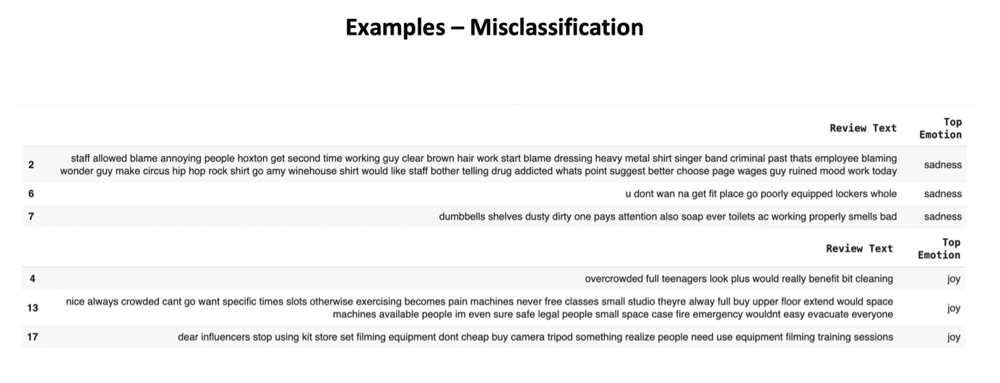

# Uncovering Customer Feedback Insights Using NLP: Topic Modelling for a Fitness Business

<h3 align="center">
  
</h3>

---

## Table of Contents

1. [Introduction](#1-introduction)  
2. [Problem Statement](#2-problem-statement)  
3. [Solution Approach](#3-solution-approach)  
4. [Exploratory Data Analysis (EDA) & Preprocessing](#4-exploratory-data-analysis-eda--preprocessing)  
5. [Emotional Analysis](#5-emotional-analysis)  
6. [Generating Actionable Insights with Phi-4](#6-generating-actionable-insights-with-phi-4)  
7. [Turning Feedback into Action](#7-turning-feedback-into-action)  
8. [Conclusion](#8-conclusion)

---
## 1. Introduction

Applying Natural Language Processing (NLP) for topic modelling is a powerful technique in business analytics. It enables organisations to uncover key themes and patterns within large volumes of unstructured text data.

In this project, topic modelling was applied to support a global fitness and gym operator by streamlining the extraction of insights from customer reviews. Instead of manually sifting through thousands of text entries, automated topic modelling helped surface hidden trends, customer pain points, and recurring themes in the feedback.

By grouping feedback into data-driven themes and combining it with sentiment analysis, the project delivered clear, actionable insights that informed service improvement across multiple locations.

By leveraging this approach, the business can make faster, data-driven decisions and enhance its strategic planning — all rooted in a deeper understanding of customer sentiment and experience.

---

## 2. Problem Statement

The business objective was to uncover the factors influencing member satisfaction and dissatisfaction—particularly identifying what drives negative reviews and how these insights can be leveraged for service improvement.

The datasets comprised 12 months of real-world customer reviews from two major platforms: Google and Trustpilot. This analysis aimed to extract actionable insights using NLP techniques, including topic modelling and sentiment analysis, to improve overall member experience.

The key goals were:
- Identify themes contributing to negative feedback  
- Highlight recurring issues across locations  
- Provide data-driven recommendations to improve customer satisfaction

Ultimately, the project provided a clear prioritisation of customer pain points — such as service quality and cleanliness — and translated those into targeted actions for the business.

---

## 3. Solution Approach

<h3 align="center">
  
</h3>

---
📍 **Data Understanding & Cleaning**  
• Combined and cleaned over 30,000 reviews from Google and Trustpilot.  
• Focused on reviews with a score below 3 stars, which accounted for 20.65% (6,293 reviews) of the dataset.  

<h3 align="center">
  
</h3>

• Applied regular expressions and text normalisation to clean the review texts, removing noise such as punctuation and stopwords.

---

🌍 **Location Analysis**  
• Among all features analysed, location emerged as a consistent factor in review sentiment.  
• While the dataset reflected a global customer base, location data remained relatively sparse, and no single site accounted for a dominant share of negative feedback.  
• Analysis of the top 30 locations by review volume revealed a notable concentration in London-based locations, which collectively contributed a significant portion of the feedback. This urban clustering suggests that higher-traffic areas may naturally attract more user commentary and scrutiny.

---

🧠 **NLP Modelling & Analysis**  
• Conducted topic modelling using BERTopic and Gensim's LDA to identify recurring themes in customer feedback across sentiment types and locations.  
• Employed BERT for emotion classification, adding a sentiment layer to distinguish between positive, neutral, and negative emotional tones in the reviews.  
• Incorporated the advanced Phi-4 language model for generating targeted, actionable insights based on identified topics and sentiment trends, providing strategic value to the business.

---

📊 **Visualisation & Interpretation**  
Produced visualisations to:  
• Map out topic distributions across sentiment categories  
• Highlight word importance and thematic clusters  
• Show sentiment and emotional tone breakdowns  

These visual tools enabled a more intuitive interpretation of the data, allowing stakeholders to quickly identify key issues, emotional drivers, and trends across regions and customer experiences.

---

## 4. Exploratory Data Analysis (EDA) & Preprocessing

<h3 align="center">
  
</h3>

After isolating reviews with negative ratings, an analysis of the most frequent words revealed a clear shift in tone. While common terms such as "equipment," "staff," "classes," and "machines" remained dominant, positive descriptors like "great," "good," "friendly," and "easy" disappeared. In their place, more critical or dissatisfied language emerged — including terms like "don’t," "time," "membership," "get," "use," and "like" — highlighting a transition toward problem-focused feedback.

<h3 align="center">
  
</h3>

<h3 align="center">
  
</h3>

Even when narrowing the scope to a refined subset of 980 reviews (from the top 30 locations), the same top words persisted. This consistency across both the full and filtered datasets reinforces that key issues are deeply embedded in member experiences. While some words like "equipment" or "people" appear in both positive and negative contexts, they still provide crucial context for downstream modelling — especially when paired with sentiment classification.

<h3 align="center">
  
</h3>

The initial topic modelling phase, conducted without large language models (LLMs), offered a broad overview of global trends in gym member complaints. This foundational step helped surface high-level themes and paved the way for deeper, more targeted analyses in the later stages of the project.

---

## 5. Emotional Analysis

The initial emotional analysis was conducted using the bhadresh-savani/bert-base-uncased-emotion model through a standard text classification pipeline. 

<h3 align="center">
  
</h3>

While this model offered a quick setup and broad emotion categories, it showed notable inconsistencies — for instance, misclassifying clearly negative reviews as "joy" or "sadness." 

<h3 align="center">
  
</h3>

Upon closer inspection, many of these reviews expressed anger or frustration, revealing that the model struggled with context-sensitive emotional cues common in customer feedback.

To improve accuracy, a more refined model — AnkitAI/deberta-v3-base-emotion, a DeBERTa-based classifier — was applied. 

<h3 align="center">
  
</h3>

This upgrade significantly reduced misclassification, better aligning predicted emotions with the actual tone of the feedback. It particularly excelled at identifying "anger", which emerged as the most prevalent emotion, present in 493 reviews.

While some degree of misclassification still persists, this model demonstrated a much stronger understanding of sentiment in context, making it a more reliable tool for downstream analysis.

It's also worth noting that many widely-used emotional categories — such as anger, sadness, joy, fear, love, and surprise — are grounded in psychological or storytelling frameworks. In the context of real-world customer experience, however, emotions like "disappointment," "frustration," and "trust" are often more relevant and informative.

This highlights an opportunity for future work: fine-tuning emotion models to detect business-relevant emotional categories could lead to richer, more actionable insights that align more closely with customer expectations and strategic goals.

---

## 6. Generating Actionable Insights with Phi-4

To deepen the analysis, the Phi-4 large language model (LLM) was employed to generate targeted, actionable insights from customer reviews — with a specific focus on feedback expressing anger, the most common negative emotion identified earlier.

Phi-4 works as a decoder-style transformer, designed to understand context and produce human-like text. In this use case, it was used to extract the top 3 pain points from individual reviews, helping surface specific issues directly from customer language.

While this approach offered valuable granularity, it operated at a more micro level, limiting its ability to detect broader patterns across the full dataset.

To capture higher-level trends, BERTopic was used alongside Phi-4. While Phi-4 generated review-level insights, BERTopic clustered reviews into broader themes, uncovering structural patterns in customer feedback. Notably, Topic 0 — the largest cluster with over 1,000 reviews — reflected a wide range of complaints grouped under a general theme. BERTopic helped distil these into clearer subtopics, revealing consistent issues across locations.

<h3 align="center">
  
</h3>

Together, these models provided both depth and breadth: Phi-4 highlighted specific pain points, while BERTopic offered a macro view of common complaint patterns, helping the business prioritise actionable areas for improvement.

---

## 7. Turning Feedback into Action

The insights generated through Phi-4 did more than just highlight issues, they provided clear, actionable recommendations for improving the overall customer experience.

### Key Issues Identified from Negative Reviews
The following pain points emerged most frequently in customer complaints:
- Equipment Maintenance Issues
- Cleanliness and Hygiene Concerns
- Poor Customer Service
- Membership Cancellation Difficulties
- Overcrowding and Limited Equipment Availability
- Unclear or Hidden Fees
- Temperature and Ventilation Problems
- Lack of Proper Gym Etiquette Enforcement
- Limited Class Offerings or Scheduling Issues
- Inadequate Personal Training Services
- Lack of Parking or Transportation Options
- Limited Facilities for Different Age Groups or Fitness Levels
- Insufficient Staff
- Lack of Clear Information
- Lack of Transparency in Membership Fees or Refund Policies
- Lack of Facilities for Non-Gym Activities
- Lack of Online Resources or Mobile App

### Actionable Insights to Address Core Issues

#### 1. Customer Service:
- **Actionable Insight 1**: **Staff Training** – Implement a comprehensive staff training program focusing on communication skills, empathy, problem-solving, and conflict resolution to improve their ability to effectively handle customer interactions.
- **Actionable Insight 2**: **Feedback System** – Establish or enhance an existing customer feedback system to regularly gather insights into customer service experiences and identify areas for improvement.
- **Actionable Insight 3**: **Customer Service Policies** – Develop transparent and easily accessible customer service policies and guidelines addressing customer issues and ensuring consistent responses to customer concerns.

#### 2. Overcrowding and Limited Equipment Availability:
- **Actionable Insight 1**: **Scheduling and Utilization** – Implement a staggered class schedule, using a booking/check-in system, to better manage gym attendance, minimize congestion, and ensure equipment availability.
- **Actionable Insight 2**: **Space Optimization** – Explore opportunities to expand gym facilities or rearrange existing spaces. Consider adding alternative equipment, such as bodyweight exercises, to alleviate overcrowding.
- **Actionable Insight 3**: **Communication and Sign-ups** – Clearly communicate gym class schedules and equipment availability through multiple channels (website, social media, newsletters). Encourage customers to sign up for classes to promote proper utilization and reduce congestion.

#### 3. Membership Cancellation Difficulties:
- **Actionable Insight 1**: **Transparent and Straightforward Policies** – Clearly articulate membership cancellation policies, including fees and timeline requirements, in an easily accessible manner. Simplify procedures by removing unnecessary steps, if appropriate.
- **Actionable Insight 2**: **Customer Service Training** – Train customer service personnel to address cancellation inquiries efficiently, empathetically, and professionally. Empower them with proper decision-making authority to avoid unnecessary delays.
- **Actionable Insight 3**: **Multiple Cancellation Channels** – Provide multiple channels through which members can request cancellation directly (e.g., online form, email, phone). Streamline processes internally and ensure timely responses.

---

### Recommendations for Service Improvement

#### 1. Cleanliness and Hygiene Concerns:
- **Recommendation**: **Adopt and Strictly Enforce a Hygienic Protocol** – Implement strict hygiene protocols aligned with health and fitness industry standards, including cleaning schedules, use of personal protective equipment, and sanitizing equipment regularly.
- **Recommendation**: **Publicize Hygiene Protocols** – Transparently share the hygiene protocols to assure customers that cleanliness concerns are being addressed adequately.
- **Recommendation**: **Signage and Reminders** – Place clear signage throughout the gym premises reminding staff and members to adhere to hygiene practices.

#### 2. Well-Maintained Equipment and Facilities:
- **Recommendation**: **Regular Maintenance and Assessments** – Implement regular equipment maintenance schedules and conduct timely assessments to ensure safe and functional gym facilities.
- **Recommendation**: **Clear Communication** – Communicate the equipment maintenance schedule to gym members, highlighting that they can expect a consistently clean and well-maintained environment.
- **Recommendation**: **Feedback Mechanism** – Establish a clear feedback system for gym members to report equipment issues, maintenance concerns, or facility-related matters.

#### 3. Well-Staffed Gym:
- **Recommendation**: **Evaluate Staffing Levels** – Routinely assess staffing levels in consideration of customer demand, gym schedule, and staffing needs. Ensure adequate staffing personnel as required.
- **Recommendation**: **Positive Staff-Member Interactions** – Encourage staff members to foster a positive and collaborative working environment, while also enhancing their customer interaction skills to promote a welcoming gym ambiance.
- **Recommendation**: **Staff Recognition** – Consider implementing a staff recognition program that rewards staff members' hard work and dedication, boosting morale and fostering a culture of appreciation.

#### 4. Clear Information and Transparency:
- **Recommendation**: **Transparent Information** – Provide clear and up-to-date information to gym members regarding various aspects of the gym experience, such as membership policies, class schedules, and gym amenities.
- **Recommendation**: **Online Resources** – Create and maintain comprehensive online resources and mobile apps, with easily accessible information relating to membership, facilities, services, schedules, and policies.
- **Recommendation**: **Transparent Billing and Policies** – Design clear and accessible billing policies.

---

The analysis conducted through Phi-4 has surfaced actionable insights and recommendations that the business can use to directly address the negative feedback provided in customer reviews. These insights offer tangible areas for improvement, helping to enhance customer satisfaction and address key pain points identified by members. By leveraging these findings, the business can take targeted actions to improve its offerings and ultimately foster a more positive customer experience.

---

## 8. Conclusion

This project combined NLP-based topic modelling and large language models to extract meaningful insights from customer feedback at both the global and local levels. The results uncovered consistent themes of dissatisfaction — particularly around customer service, cleanliness, and overcrowding — and translated them into actionable steps for improvement.

By prioritising these areas and implementing the recommended changes, the fitness business can directly address the concerns reflected in its reviews, foster greater customer satisfaction, and enhance the overall member experience across its locations.

---

